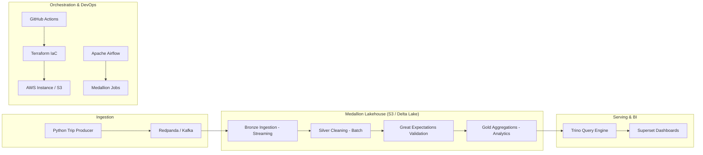

# Architecture - Real-Time Ride-Hailing Lakehouse

This document outlines the technical architecture and data flow of the medallion lakehouse.

## System Diagram

## Data Layers

### 1. Bronze (Raw)
- **Source**: Kafka topic `trips.live`.
- **Format**: Delta Lake.
- **Process**: Spark Structured Streaming with a 5-second trigger. 
- **Goal**: Hard landing for all raw incoming events with `_ingest_ts`.

### 2. Silver (Cleansed)
- **Source**: Bronze Delta table.
- **Format**: Delta Lake.
- **Transformations**: 
    - Deduplication on `trip_id`.
    - Calculation of `trip_duration_minutes` and `fare_per_mile`.
    - **H3 Spatial Indexing**: Mapping Pickup/Dropoff LocationIDs to Latitude/Longitude centroids and generating H3 resolution 9 hexagons.
- **DQ Check**: Great Expectations validation for range and schema.

### 3. Gold (Business)
- **Source**: Silver Delta table.
- **Format**: Delta Lake / Iceberg.
- **Structure**: 
    - `fact_trips`: Flattened star-schema fact table.
    - `agg_daily_revenue`: Pre-calculated daily metrics for trend analysis.
    - `agg_hourly_demand`: Spatial-temporal aggregations for heatmaps.

## Key Design Principles
- **Ephemeral Compute**: To maintain $0.00 cloud costs, the entire stack builds, processes, and destroys itself on every run.
- **Statelessness**: No data is stored on the compute server; everything resides in S3.
- **Exactly-Once**: Achieved via Spark Structured Streaming checkpoints and Delta Lake's ACID transactions.
