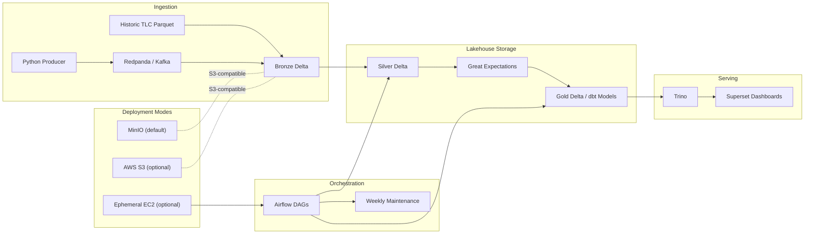
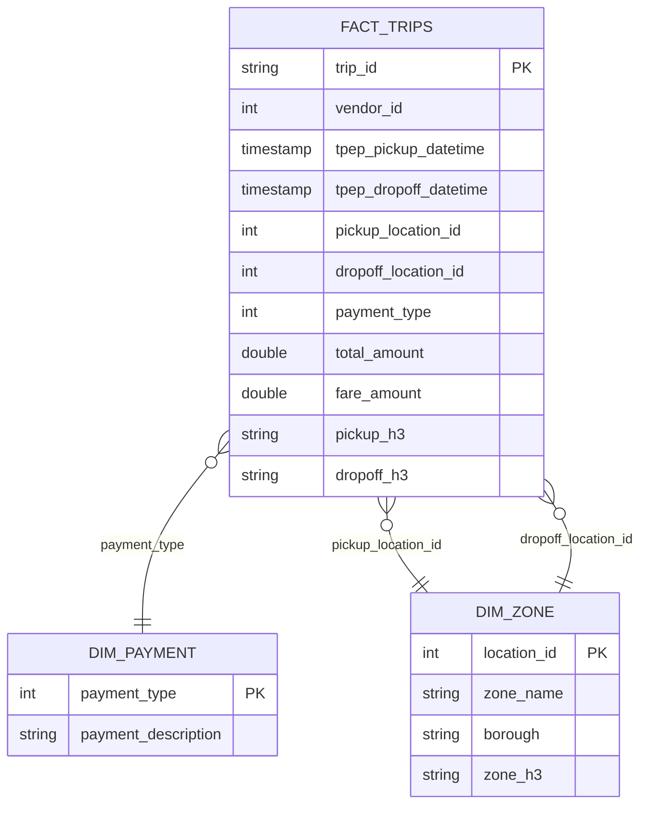

# Architecture - Real-Time Ride-Hailing Lakehouse

This project is intentionally designed as a local-first, S3-compatible medallion lakehouse so it can be demonstrated at zero dollars while still matching the shape of a production Data Engineering platform.

## System Diagram

## Why This Architecture Fits a $0 Goal
- Object storage is the system of record.
- Compute is disposable.
- Development happens locally with MinIO instead of paid S3.
- The code paths remain S3-compatible, so the same jobs can target AWS only when needed for a demo.

## Data Layers

### Bronze
- Inputs: Kafka live stream plus optional historic parquet bootstrap
- Format: Delta Lake
- Key fields: source payload, `kafka_ts`, `_ingest_ts`, `record_source`
- Goal: immutable raw landing zone

### Silver
- Deduplicates by `(trip_id, tpep_pickup_datetime)` using latest ingestion timestamp
- Rejects negative fares and negative trip durations
- Computes `trip_duration_minutes` and `fare_per_mile`
- Enriches pickup and dropoff zones with H3 resolution 9

### Gold
- `fact_trips`
- `agg_daily_revenue`
- `agg_hourly_demand`
- `dim_payment`
- `dim_zone`

## Orchestration
- `hourly_silver_processing`: run Silver transforms and DQ checks
- `daily_gold_modeling`: build serving tables
- `weekly_compaction`: lightweight placeholder for maintenance strategy documentation

## Data Quality Boundaries
- Bronze to Silver: schema expectations and null checks
- Silver to Gold: uniqueness on business keys, fare and duration ranges, H3 format checks
- Airflow is expected to fail fast when DQ breaks

## Data Model ERD

## Interview Talking Points
- Exactly-once semantics come from Structured Streaming checkpoints plus Delta transactions.
- H3 is used instead of geohash because hexagons reduce directional bias and work well for urban demand heatmaps.
- Delta is a better fit for lightweight Bronze and Silver write-heavy paths.
- Iceberg remains relevant for multi-engine portability, but this repo stays local-first and keeps the Gold layer simple enough to run cheaply.
